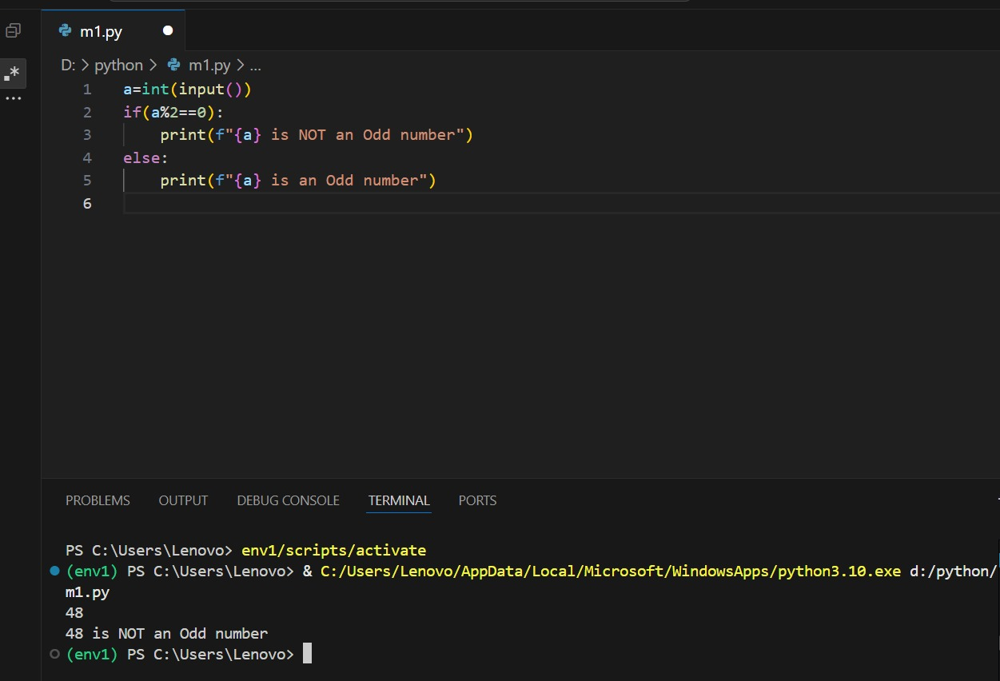
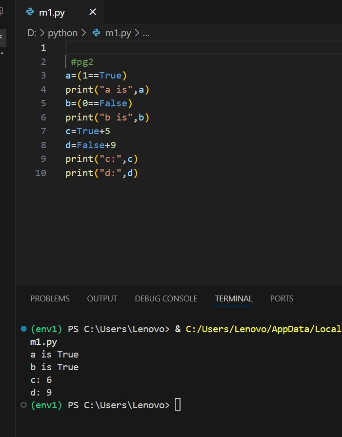
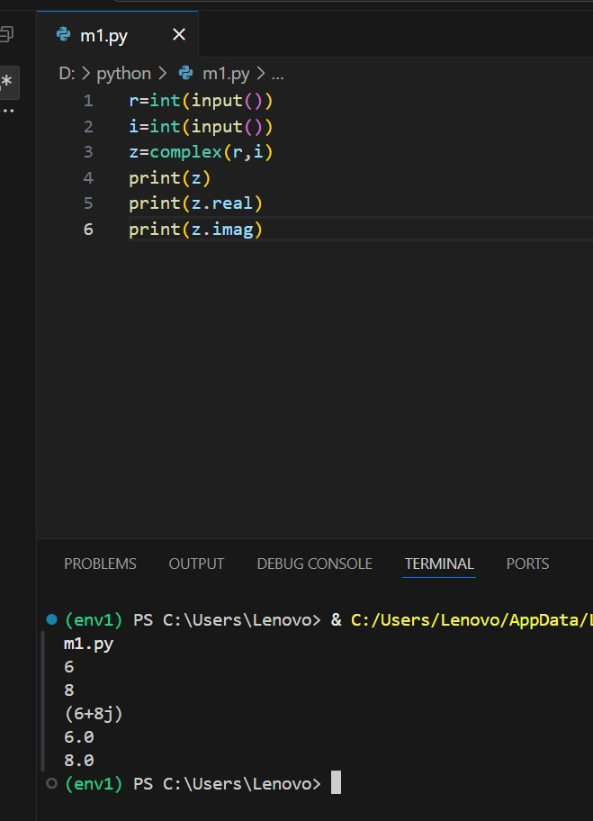

# Module - 1
# Date:19/10/25
# Conditional Statements in Python: Even or Odd Checker
# Aim:
      
    To write a Python program to check whether the given number is **even** or **odd** using `if...else` statements.

# Algorithm:

1. Get an input from the user.
2. Convert the input to an integer and store it in a variable `a`.
3. Use the modulo operator `%` to check if `a % 2 == 0`.
   - If true, print `"EVEN"`.
   - Else, print `"ODD"`.
4. End the program.

# Program:
```
a=int(input())

if(a%2==0):
    print("EVEN")
else:
    print("ODD")

```
# Output:


# Result:


# Ex 1:Datatypes-Boolean Expression Evaluation in Python
# Aim
    To write a Python program that evaluates and prints the results of boolean and arithmetic expressions involving True and False.

# Algorithm
Set variable a to the result of the expression 0 == True.
Set variable b to the result of the expression False == False.
Set variable c to the result of the expression True + 5.
Set variable d to the result of the expression False + 9.
Print the value of a with the label "a is".
Print the value of b with the label "b is".
Print the value of c with the label "c:".
Print the value of d with the label "d:".

# Program
```
a=(0==True)
b=(False==False)
c=True+5
d=False+9
print("a is", a)
print("b is", b)
print("c:", c)
print("d:", d)
```


# Output

# Result

# Datatypes-Character Literal in Python
# Aim:
To write a Python program that prints the characters 'T' and 'a' using character literals.

# Algorithm
Print the character 'T'.
Print the character 'a'.
# Program
```
print("T")
print("a")
```
# Output

# Result

# Datatypes-Complex Number Creation in Python
# Aim
    To write a Python program that reads two integers, creates a complex number using them, and then prints the complex number along with its real and imaginary parts.

# Algorithm
Read an integer input from the user and assign it to the variable a (real part).
Read another integer input from the user and assign it to the variable b (imaginary part).
Create a complex number x using the complex(a, b) function.
Print the complex number x.
Print the real part of x using x.real.
Print the imaginary part of x using x.imag.
# Program
```
a=int(input())
b=int(input())
c=complex(a,b)
print(c)
print(c.real)
print(c.imag)
```

# Output

# Result

# Datatypes-Read and Print a String in Python
# Aim
To write a Python program to read a string from the user and then print it.

# Algorithm
Assign a variable named men_stepped_on_the_moon.
Use input() to read a string from the user and store it in the variable.
Print the value stored in the variable.
# Program
```
men_stepped_on_the_moon=input()
print(men_stepped_on_the_moon)
```
# Output

# Result
      